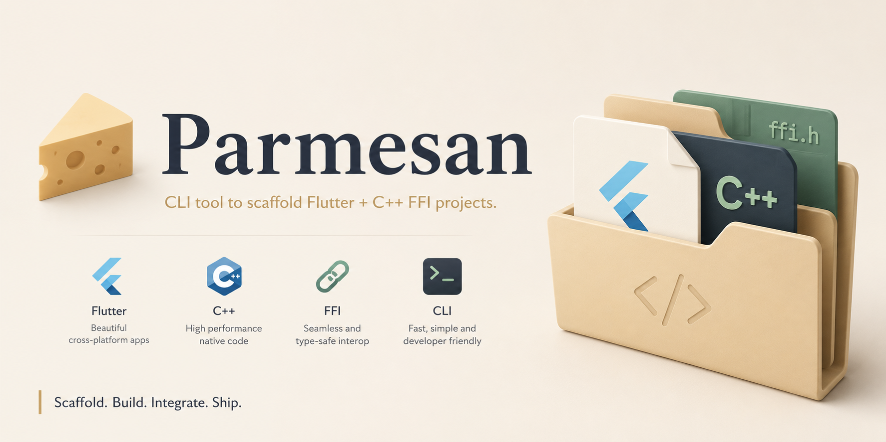

# Parmesan



CLI tool to scaffold Flutter + C++ FFI projects.

## Features

- **Module management** — Add C++ modules with auto-generated headers, bridge code, and Dart FFI bindings
- **Cross-platform builds** — Add Windows and Linux platform support with CMake configuration (macOS not supported)
- **Automatic binding generation** — Parse C++ headers and generate `dart:ffi` bindings

## Prerequisites

- Dart SDK >=3.11.5
- Flutter SDK
- C++ compiler (MSVC for Windows, GCC/Clang for Linux)
- CMake

## Platform Support

| Platform | Supported | Notes |
|----------|-----------|-------|
| Windows  | Yes       | MSVC compiler, CMake |
| Linux    | Yes       | GCC/Clang compiler, CMake |
| macOS    | No        | macOS does not use CMake for compilation. Xcode requires source files to be added through its IDE and does not handle external edits gracefully, making Parmesan's CLI-based workflow incompatible. |
| Android  | Theoretical | Possible in theory, but not tested or officially supported. |
| Web      | Theoretical | Possible in theory, but not tested or officially supported. |

> **Note:** Parmesan is designed and tested specifically for desktop applications. While Android and Web support is theoretically possible, this package is meant and tested for desktop apps.

## Usage

Parmesan is designed to be used as a **dev dependency** in your Flutter project. This keeps the tool versioned alongside your project code and avoids global installation issues.

### Step 1: Install as a dev dependency

```sh
flutter pub add --dev parmesan
```

This adds Parmesan to your `pubspec.yaml` under `dev_dependencies`. It is only needed during development to generate code — it is not shipped with your app.

### Step 2: Add platform support

```sh
dart run parmesan add:platform windows
dart run parmesan add:platform linux
```

This scaffolds the C++ bridge files (`src/bridge/bridge.h`, `src/bridge/bridge.cpp`) and injects the necessary CMake configuration into your Flutter project's platform runner. Run this **once per platform** you want to target.

> **Note:** Run `add:platform` before adding modules so the bridge infrastructure is in place.

### Step 3: Add C++ modules

```sh
dart run parmesan add:module my_module --functions "int32_t compute(int32_t x),void process()"
```

This creates a new C++ module under `src/my_module/` with a header and implementation file. You can then open these files and write your C++ logic.

Omit `--functions` to enter function signatures interactively:

```sh
dart run parmesan add:module my_module
```

Options:
- `-f, --functions` — Comma-separated function signatures
- `-p, --path` — Path to the project (default: current directory)

> **Convention:** All functions exposed to Dart must be declared with `MODULE_EXPORT` in the module's header file (`.h`). The `generate:bindings` command only scans header files.

### Step 4: Generate Dart FFI bindings

```sh
dart run parmesan generate:bindings
```

This scans all modules in `src/`, regenerates the bridge files, and creates a single Dart bindings file at `lib/bindings/parmesan_bindings.dart`. **Run this every time you change your C++ module headers** so the Dart side stays in sync.

Options:
- `-l, --library` — Native library name (auto-detected from pubspec.yaml)
- `-p, --path` — Path to the project (default: current directory)

### Import the generated bindings

```dart
import 'package:your_project/bindings/parmesan_bindings.dart';
```

The generated file exposes Dart functions that directly call your C++ code through FFI.

## Running Tests

```sh
dart test
```

## License

MIT
